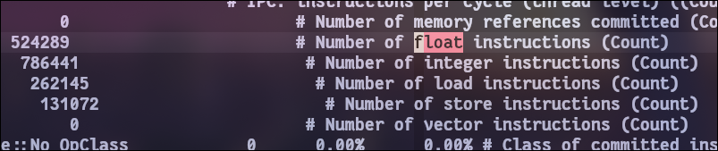
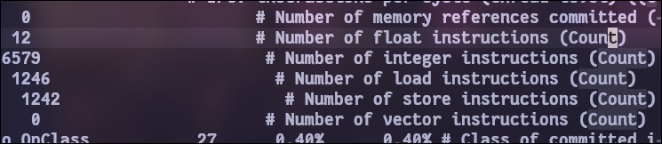

# 实验四　　流水线性能实验

## 实验内容

1. 学习如何使用gem5对程序进行性能分析
2. 评估不同流水线配置对系统整体性能的影响
3. 实际运用Amdahl定律

## 模拟前的问题

1. 如果将程序中的指令分为整数、浮点和内存指令三类，你认为每个类别在程序中所占比例是否相等？

在多数情况下，这三种指令的比例不会相等。

具体到这次的工作负载，对于DAXPYWorkload整数计算几乎集中于循环，内存指令在于读取数据，程序的大部分都是循环和浮点数计算，因此在这个具体的工作负载中，我认为浮点指令和整数指令占比很大，内存指令占比较小；

对于HelloWorkload，不涉及很多浮点计算，内存操作也不会很多，应该是整数计算指令占大多数。

2. 你认为不同的程序是否会有不同的三类指令构成比例？为什么？

对于不同的程序这三类指令的比例当然是不同的。浮点计算是在科学计算，AI学习过程中需要大量使用的计算，在这种程序中浮点计算的比例会很高；在包含大量分支预测，循环语句的程序中，整数计算指令也会很多，用于跳转等分支操作；在数据库管理程序中中会出现频繁的数据存取访问，所以在数据库程序中就会有很多的内存指令。

## 实验步骤

### 步骤１：更换工作负载并分析

将CPU模型设置为HW2TimingSimpleCPU，分别设置工作负载为DAXWorkload和HelloWorkload，进行仿真，结果如下：

仿真条件为：CPU=HW2TimingSimpleCPU, memory=HW2DDR3_1600_8x8, cache=HW2MESITwoLevelCache, board=HW2RISCVBoard, workload=DAXPYWorkload，其结果为：

通过计算发现，浮点操作占30.769%，整数操作是46.154%，读取操作15.385%，写入操作7.69%，内存指令共计23.075%，可以发现之前关于操作指令比例的分析是正确的，浮点和整数指令比内存指令占比高。

仿真条件为：CPU=HW2TimingSimpleCPU, memory=HW2DDR3_1600_8x8, cache=HW2MESITwoLevelCache, board=HW2RISCVBoard, workload=HelloWorkload，其结果为：

可以发现，浮点操作占0.132%，整数操作占72.46%，读取操作占13.834%，写入操作占13.68%，内存指令共计占27.514%，可以发现之前对HelloWorkload的分析也是正确的，大部分是整数指令。同一个程序内三种指令并非占比相等。

同时关于问题２，我们对比两个程序就可以发现，不同的程序会有不同的三类指令构成比例。

### 步骤２：修改发射延迟和浮点操作延迟并分析结果

在这一步会将CPU模型设置为HW2MinorCPU，工作负载为DAXPYWorkload，调整发射延迟和浮点操作延迟来完成仿真。

实际的仿真结果是：

| 发射延迟 | 浮点操作延迟 | 仿真时间(ms) |
| -------- | ------------ | ------------ |
| 3        | 2            |              |
| 2        | 3            |              |
| 6        | 1            |              |
