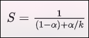
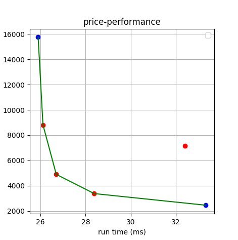

# 实验五　乱序处理器

## 实验目的

1. 探索应用程序在微体系结构改变时具有不同的行为。
2. 探索特定体系结构中的瓶颈。
3. 提高你对乱序处理器体系结构的理解。

## 模拟前的问题（１）

1. HW3BigCore相对于HW3LittleCore的平均加速比将是多少？你能使用你的流水线参数预测一个上限吗？提示：你可以使用Amdahl's定律对速度上限进行预测，使用最优值。

根据给出的参考数据如下表：

| CPU           | width | rob_size | num_int_regs | num_fp_regs |
| ------------- | ----- | -------- | ------------ | ----------- |
| HW3LittleCore | 4     | 152      | 100          | 84          |
| HW3BigCore    | 12    | 352      | 280          | 224         |

再结合Amdahl's定律如下：

上一个实验中我们已经分析过这个表达式，alpha代表的是受益于条件改善导致被优化的那一部分时间的比例（代表原始程序中可以被本次优化加速的部分时间占比），k代表了资源改善的任务的加速比（可加速部分的加速比），S是理论加速比。

width表示的是流水线级数，rob_size表示的是可以容纳的指令数目，这两者应该是影响性能最主要的因素，可以认为这两者的性能改善会使得处理器在任何处理任何事务时都收益，公式中aplha为1,因此这里width从4变为12，可以认为实现了三倍性能，认为加速比为3，rob_size从152变为352，可以认为是2.3158的加速比。

剩下的两个寄存器数量和流水线并行度不直接相关，不直接影响处理器性能，暂时忽略它们对于加速比的影响。

由此可以认为HW3BigCore相对于HW3LittleCore的加速比为(3+2.3158)/2=2.6579.

2. 你认为所有的工作负载都会在HW3BigCore和HW3LittleCore之间获得相同的加速比吗？

应该不会。对于不同的算法对硬件资源的需求，调度等都不相同，对资源的利用情况也不同，不会获得相同的加速比。

## 实验步骤

### 步骤１：完成HW3LittleCore和HW3BigCore的性能对比

分别以HW3BigCore和HW3LittleCore为CPU，设置工作负载为DAXPY, Bubblesort, BFS，进行模拟仿真，运行仿真的结果如下：

| \             | 仿真时间(ms) |           |            | IPC      |          |            |
| ------------- | ------------ | --------- | ---------- | -------- | -------- | ---------- |
| 工作负载      | DAXPY        | BFS       | Bubblesort | DAXPY    | BFS      | Bubblesort |
| HW3BigCore    | 2.818857     | 25.896948 | 4.699277   | 0.162746 | 0.612065 | 1.340163   |
| HW3LittleCore | 2.819092     | 33.329917 | 4.609565   | 0.162732 | 0.475567 | 1.366246   |

_这里因为仿真精度，实际仿真时间相差不大的时候被舍入为相同结果，这里代用仿真时钟数的结果换算为仿真时间作为结果记录_

1. HW3BigCore相对于HW3LittleCore的加速比是多少？

矩阵乘法的加速比是：1.000083367
广度优先搜索的加速比是：1.28702
冒泡排序加速比：0.9809094

2. HW3BigCore相对于HW3LittleCore的平均IPC改善是多少？注意：确保使用正确的平均值报告平均IPC改善。

首先计算平均IPC.

平均IPC可以由三个工作负载的指令数之和初一时钟周期数之和。以下为仿真结果：

| \             | 时钟周期数 |          |            | 指令数 |          |            |
| ------------- | ---------- | -------- | ---------- | ------ | -------- | ---------- |
| 工作负载      | DAXPY      | BFS      | Bubblesort | DAXPY  | BFS      | Bubblesort |
| HW3BigCore    | 5637714    | 51793896 | 9398555    | 917809 | 45957128 | 17719866   |
| HW3LittleCore | 5638184    | 66659834 | 9219130    | 917772 | 38789951 | 16990077   |

对于HW3BigCore，可以计算平均的IPC为:1.106616，而HW3LittleCore的平均IPC是：0.695532，可以计算出HW3BigCore相对于HW3LittleCore的平均IPC改善为59.1035%.

3. 一些工作负载显示出更多的加速比。哪些工作负载显示出较高的加速比，哪些显示出较低的加速比？查看测试代码（.c和.s文件都可能有用），并推测影响HW3BigCore和HW3LittleCore之间IPC差异的算法特性。哪些特性会导致性能改善较低，哪些特性会导致性能改善较高？

可以发现广度优先算法负载的加速比较高，冒泡排序的加速比低，甚至小于1.

简单分析代码，可以发现冒泡排序算法的特点是：多比较，多判断；广度优先搜索的特点是：多循环；矩阵乘法的特点是：多访存，无判断。

总的来说，有以下几种算法特性：

- 分支预测：判断很多的算法（冒泡排序）会引入大量的分支预测。引入大量的分支预测会导致性能改善下降，尤其是当出现大量的预测错误，会导致多次的流水线中断和清空，而且HW3BigCore的中断/清空开销更大，使得性能改善很不明显甚至出现负优化。

- 数据依赖：在矩阵乘法算法，存在一些数据依赖，后面的指令需要等待前面的计算结果，会导致计算瓶颈，优化结果不明显。

- 访存模式：如果算法大量的访存，如矩阵加法，可能会有很大的内存延迟。关于内存延迟，增大重排序缓冲区是会有很明显的优化的，应该会使得优化结果很明显。

4. 哪个工作负载对于HW3BigCore具有最高的IPC？这个工作负载有什么独特之处？

冒泡排序算法对于HW3BigCore具有最高的IPC。由于我们写的HW3BigCore是乱序处理器，他的指令级并行是通过指令重排序实现的，通过对指令的重新排序充分利用硬件资源。冒泡排序没有矩阵计算里面复杂的数据依赖，乱序处理器就可以对指令进行重排而不受什么限制，提高整体的执行效率，也就会有较高的IPC。

_广度优先搜索算法和矩阵乘法，这两者有复杂的数据依赖，一些指令需要等待之前的指令运行完毕；具有复杂的分支预测，预测失败时，中断开销很大，都会导致IPC下降，总的来说，还是因为这两个算法的复杂性导致它们无法充分利用硬件资源，无法充分发挥乱序处理器的性能。_

### 步骤二：设计中等核心

在HW3BigCore和HW3LittleCore之间找到一个折中。这个核心需要在尽量使用HW3LittleCore资源的同时尽量接近HW3BigCore的性能。设置CPU模型为HW3MediumCore，完成相关仿真测试。

## 模拟前的问题（２）

1. 如果你只能在之前使用的3个工作负载中选择一个来计算加速比，你会选择哪个工作负载？为什么？

应该选择BFS算法，因为之前计算三个负载的加速比，可以发现从HW3LittleCore到HW3BigCore，这个算法的加速是最显著的（和1相差最大的），选择这个负载可以获得更明显的实验结果，选择另外两个加速效果不明显。

2. 现在我们已经制定了测量成本和收益的函数，为流水线配置4个中等核心设计。这些设计中并不是所有的设计都有“最佳”成本-收益权衡。在你的报告中包括以下图： 创建一个带有成本在y轴上和性能在x轴上的帕累托前沿图。这将是一个散点图，有6个点：两个“big”和“LITTLE”核心，以及你的4个中等核心设计。然后，在“最佳”设计上“连接这些点”。

可以进行如下设计并完成仿真：

| CPU     | width | rob_size | num_int_regs | num_fp_regs | 面积得分 | 仿真时间(ms) |
| ------- | ----- | -------- | ------------ | ----------- | -------- | ------------ |
| Little  | 4     | 152      | 100          | 84          | 2456     | 33.330       |
| Medium1 | 8     | 304      | 200          | 168         | 8816     | 26.111       |
| Medium2 | 8     | 304      | 100          | 84          | 7160     | 32.394       |
| Medium3 | 4     | 152      | 200          | 168         | 3376     | 28.384       |
| Medium4 | 4     | 304      | 200          | 168         | 4896     | 26.7         |
| Big     | 12    | 352      | 280          | 224         | 15752    | 25.897       |

做出帕累托前沿图如下：

图中左上角和右下角的蓝色坐标点是HW3BigCore和HW3LittleCore，红色的点是自己设计的中核，有一个不太好的设计没有连接入曲线。

3. 假设你是一名工程师，正在设计这个中等核心。根据这次早期分析，你会建议你的团队倾向哪些设计，如果有的话？解释原因。 （注意：你可能需要在上面的图中注释。）

在已经设计好的四个核心中，显然Medium4是最好的设计。可以发现，对CPU核心的重排缓冲区大小，整数和浮点寄存器大小进行优化都可以得到很明显的性能提升，但是在优化流水线级数的时候提升不那么明显，这可能和中断开销等有关。我有另外跑了几组数据，结果表明优化整数寄存器对性能提升是最明显的。

## 心得体会

通过本次实验，我对于乱序处理器的相关工作原理和优化方式有了基本的了解，学习了如何进行有效的硬件优化，并且学会了在性能和成本之间做出平衡。
