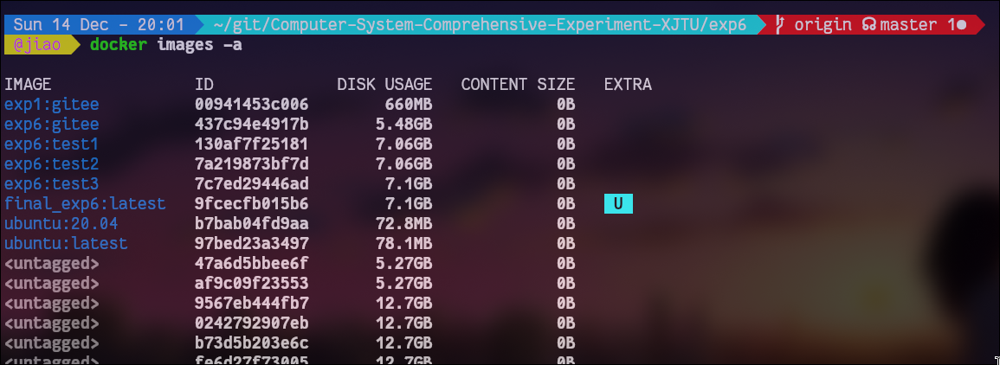
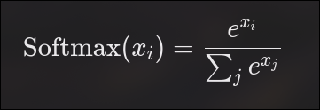
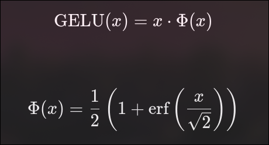
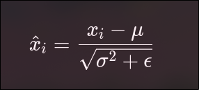

# 实验六　异构加速器设计

## 实验内容　

1. 学习掌握GEM5-SALAM
2. 基于GEM5-SALAM设计一个Transformer加速器（或任选其他应用加速器，但是不能直接用已有例子）。
3. 除了2，可自选题目，完成一个综合设计实验。例如在FS模式下完成与OS相关的综合实验；或结合编译器实验，自己设计一个DSL并在GEM5运行。

实验目标：在不涉及RTL, FPGA等的前提下，通过系统级建模的方式理解异构加速器的设计方法，并且基于 gem5-SALAM 实现一个简化版Transformer 加速器，探索其硬件调度、内存访问与性能提升策略。

## 实验环境构建

### gem5-salam

gem5-SALAM（System Architecture Lab for Accelerator Modeling）是 gem5 的一个分支版本，面向加速器体系结构建模与教学研究。该框架在 gem5 的基础上提供了一套加速器抽象接口，使得用户可以通过 C++ 描述加速器的功能行为和调度流程，而无需编写 RTL 或 FPGA 代码，从而将实验重点放在 加速器体系结构与系统级性能分析 上。

### 环境构建过程

我这里环境的构建选择使用官方文档中的docker方案，通过运行`docker　build`完成实验环境的创建。

值得注意的是，下载出来的库中的Dockerfile，有一些错误，比如`clang`　`llvm`版本错误，以及后续的make会有运行报错，需要自行适配版本。这里我选择修改Dockerfile，改为：ubuntu 20.04, clang 12, llvm 12, 同时修改之后`RUN make`的相关命令完成了环境的构建，并将生成的镜像存储为`final_exp6:latest`，以备后续使用。

镜像生成结果如下：

## gem5-salam 文件组织架构及其分析

关于本实验过程中涉及的所有文件，这里简单的对其进行一些说明(以`/gem-SALAM`为参考目录)。

- BM_ARM_OUT:这个文件是运行仿真结果保存的路径，其中的`system.terminal`会在调试中用到，`stats.txt`保存的是仿真结果分析。

- tools/run_system.sh:这个文件是把仿真跑起来的脚本文件。

- benchmarks/sys_validations/:这个目录下我们会进行加速器设计代码编写。

这里我选择在benchmarks/sys_validations下创建名为qkv的文件夹，作为本次实验的source目录，在此目录下，我写的代码文件结构和官方提供的示例基本一致，这里也做简单介绍：

- config.yml:这个文件主要用于生成qkv_clstr_hw_defines.h，我在这个文件里开了矩阵空间，他会自动生成相应的地址，这个地址会在之后的矩阵操作用到。

- 各种defines.h: 主要是对一些常量，函数进行定义。
- hw/top.c: top.c主要进行的是DMA操作的定义。
- hw/qkv.c:包括了Transformer的（几乎）全部工作流程。
- sw/bench.h:我在这里定义了初始化需要的函数，主要是内存空间初始化和输入矩阵的随机生成。
- sw/main.cpp:主要是进行仿真流程的控制。
- sw/isr.c: 中断处理。
- sw/boot.x:仿真运行所需文件。

## 加速器设计架构与工作原理

本实验中设计的 Transformer 加速器主要由以下几个部分构成：

- DMA 控制模块（top.c）：负责主存与加速器内部数据之间的数据搬运，减少 CPU 参与数据拷贝的开销。

- 计算与调度模块（qkv.c）：实现 Transformer 的核心计算流程，并通过状态机控制各阶段执行顺序。

- 仿真控制与软件接口（main.cpp）：通过内存映射寄存器启动加速器、查询运行状态并完成仿真流程控制。

该架构在系统层面模拟了真实异构 SoC 中 CPU + 加速器 + DMA 的典型组织方式。

### 设计 DMA 的目的

在加速器设计中引入 DMA，主要是为了模拟真实硬件中 高效的数据搬运机制，避免 CPU 直接参与大规模内存拷贝操作，从而降低系统开销并提升整体性能。

## gem5-salam 中Transformer加速器设计方法和计算流程

考虑到完整 Transformer 结构的复杂性，本实验对计算流程进行了适当简化，在保留主要计算特征的前提下降低实现难度。实验中假设所有输入与输出矩阵均为同尺寸的正方形矩阵。

主要计算流程如下：

1. Q, K,　V, 输入的处理，这里假设权重都是单位矩阵，就应该是三个输入矩阵乘单位矩阵，所以可以跳过这一步，直接拿输入矩阵当作处理过的矩阵进行下一步；

2. Q\*K^T, 这一步是计算Q矩阵乘K矩阵的转置，k转置的列其实就是转置前的行，所以计算过程就是这两个矩阵对应位置相称，其结果放到输出矩阵的对应位置。这里的寻址方式是：第i行第j列的元素，就用`i*(row_size)+j`的方式进行寻址。

3. softmax,
   在标准Transformer中，softmax用于对注意力分数进行归一化，计算过程为：

该操作通常以 行为单位 进行，即对注意力矩阵中每一行的数据分别进行 Softmax 计算。
在本实验中，为了降低实现复杂度并突出系统级数据流与调度逻辑，对 Softmax 过程进行了简化处理，主要体现在以下几个方面：

- 不考虑溢出，归一化误差等问题；
- 不严格追求精度和稳定性；
- 重点关注的是计算流程和内存访问。

4. attention输出计算。完成 Softmax 操作后，将得到归一化的注意力权重矩阵。接下来需要将该矩阵与 V 矩阵进行乘法运算，得到最终的 Attention 输出。

5. FFN. 在这一步中主要是进行线性操作和非线性操作。由于线性操作简单且不是优化的重点，这里假设所有的线性操作等价于对结果加一个全零矩阵，因此这一步省略，直接进行非线性操作。完成layernorm计算和激活即可。计算方式为：

6. 完成多头的拼接。

## 在完成实验过程中需要注意容易踩坑的地方：

1. **禁止在 `top.c` 以及我们编写的逻辑功能实现（工作负载）文件中进行任何内存分配操作**，包括：
   - 静态数组分配
   - 动态内存分配
   - 大部分 `math.h` 中的函数
   - `printf`

   否则可能会出现难以理解的异常行为。

2. 所有数组访问和函数启动，必须通过**向指定地址写入数据**来完成。例如：
   - 启动函数：向函数地址（控制寄存器）写入 `0x01`
   - 访问数组元素：通过计算地址偏移量进行访问

3. 仿真的运行方式以及 CPU 类型的选择，统一通过：

   `tools/run_system.sh`

4. 所有数组的定义必须**全部写在 `config.yml` 中**。

## 仿真结果和性能分析

在本实验中，我分别在 TimingSimpleCPU、MinorCPU 和 DerivO3CPU 三种不同 CPU 架构条件下，对 64 维、2 头 的 Transformer 计算任务进行了仿真，对比了 不使用加速器 与 使用 Transformer 加速器 两种情况下的系统性能。

不使用Transformer加速的仿真结果如下：

| CPU type        | time(ms) | cpi    |
| --------------- | -------- | ------ |
| TimingSimpleCPU | 6643.541 | 1      |
| MinorCPU        | 1393.213 | 29.752 |
| DerivO3CPU      | 738.846  | 15.764 |

使用Transformer加速的仿真运行结果如下：

| CPU type        | time(ms) | cpi    |
| --------------- | -------- | ------ |
| TimingSimpleCPU | 135.791  | 1      |
| MinorCPU        | 64.243   | 41.844 |
| DerivO3CPU      | 7.545    | 20.783 |

从整体结果可以看出，引入 Transformer 加速器后，在三种 CPU 架构下系统执行时间均显著降低，说明将计算密集型的 Transformer 核心计算卸载至专用加速器能够有效提升系统整体性能。其中，DerivO3CPU 配合加速器时获得了最短的执行时间，表明高性能乱序 CPU 在加速器控制、数据准备以及结果回收阶段具有更高的效率。

需要注意的是，在使用加速器的情况下，MinorCPU 与 DerivO3CPU 的 CPI 相比未使用加速器时有所上升，这是由于在加速器运行期间，CPU 主要承担控制、等待与中断处理等任务，指令执行中包含较多的空闲与同步开销，从而导致 CPI 数值增大。这一现象并不代表系统性能下降，而是反映了 计算负载已从 CPU 转移至加速器，CPU 不再是主要性能瓶颈。

综合来看，实验结果表明加速器性能不仅取决于其自身的计算能力，还受到 CPU 架构特性、系统调度机制以及 CPU–加速器协同方式的影响。不同 CPU 模型在控制路径、访存行为和调度效率上的差异，最终体现在系统级性能表现上，这也体现了从系统架构层面分析异构加速器设计的重要性。

## 心得感悟

通过本次基于 gem5-SALAM 的异构加速器设计实验，我对加速器体系结构的整体设计流程有了更加系统和工程化的认识。与以往仅从算法或单一硬件模块出发不同，本实验从系统级视角出发，将加速器视为 SoC 中的一个独立硬件单元，重点关注其与 CPU、内存系统之间的协同关系。在实际实现过程中，首先需要理清 gem5-SALAM 的文件组织结构，即通过 Python 配置文件完成系统级组件的实例化与互连，而在 C++ 层完成加速器内部模块（控制器、DMA、Scratchpad 与计算单元）的功能建模。这种“Python 描述系统拓扑 + C++ 描述硬件行为”的分层方式，使得系统结构与加速器实现逻辑相对解耦，有助于从整体架构角度理解异构系统的运行机制。在仿真流程上，加速器的启动、数据搬运、计算执行与结果回写均通过明确的状态机进行调度，CPU 仅通过内存映射寄存器进行控制，较好地模拟了真实硬件系统中加速器的工作模式。通过对仿真过程的分析可以发现，加速器性能的提升并不仅仅来源于计算单元本身，更在于对数据流和访存行为的合理组织，例如通过 DMA 显式管理数据传输、通过 Scratchpad 减少主存访问次数，从而降低系统整体延迟。尽管 gem5-SALAM 并不追求门级或精确周期级建模，但其在系统级层面对加速器调度、内存访问模式和性能趋势的刻画具有较高的参考价值。本实验使我深刻认识到，加速器设计是一项高度系统化的工作，需要在文件组织、模块划分、仿真流程和性能分析等多个层面进行综合权衡，也为后续进一步学习更底层的硬件实现或更复杂的系统级优化奠定了基础。
